

# 🎨 awesome-gpt-image-2-playground

**The only GPT Image 2 prompt library you can run for free in your browser.**

[ ▶️ **Try It Free Online** ](https://gptimage2.veilo.dev?utm_source=github&utm_medium=readme&utm_campaign=hero) &nbsp;·&nbsp; [Edit Your Image](https://gptimage2.veilo.dev/edit?utm_source=github) &nbsp;·&nbsp; [Prompt Lab](https://gptimage2.veilo.dev/lab?utm_source=github) &nbsp;·&nbsp; [Docs](https://gptimage2.veilo.dev/docs/prompting?utm_source=github)

<table>
<tr>
<td></td>
<td>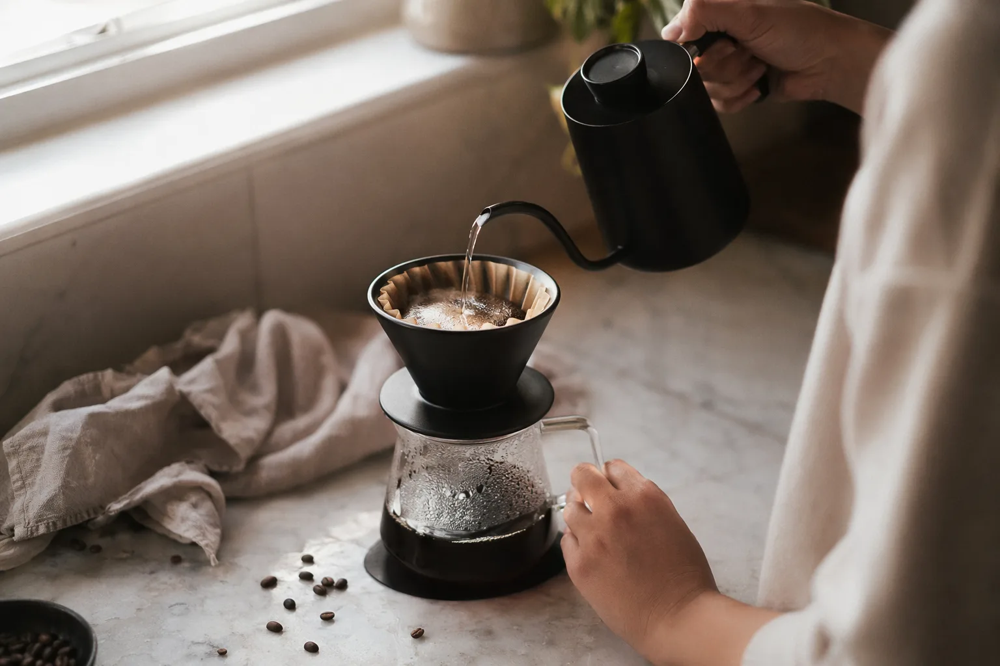</td>
<td>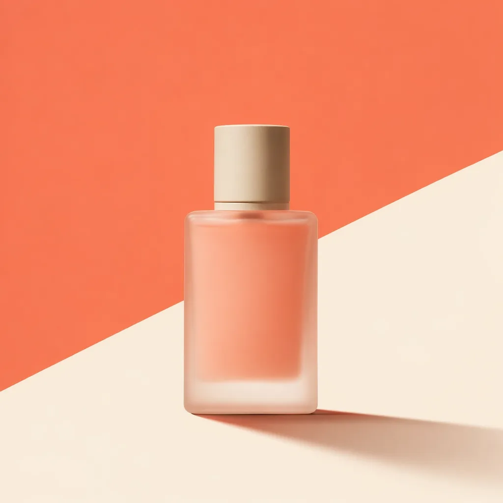</td>
<td>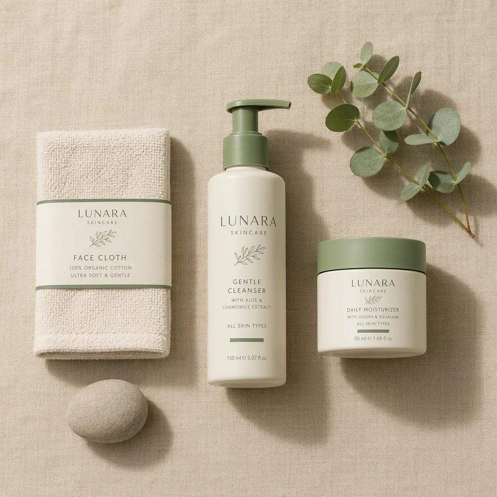</td>
<td>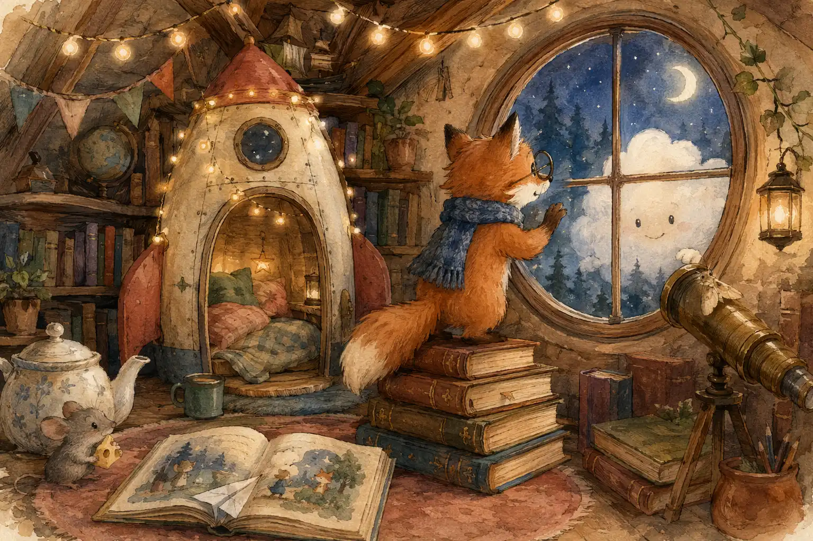</td>
</tr>
</table>

🌐 **Languages**: [English](README.md) · [简体中文](README_zh-CN.md) · [繁體中文](README_zh-TW.md) · [日本語](README_ja.md) · [한국어](README_ko.md) · [Español](README_es.md) · [Português](README_pt.md) · [Français](README_fr.md) · [Deutsch](README_de.md) · [العربية](README_ar.md) · [Русский](README_ru.md) · [Tiếng Việt](README_vi.md)

---

## 🚀 30-second pitch

Other GPT Image 2 prompt lists make you copy, paste, and pray. **We let you run every prompt right from your browser, for free.**

- ⚡ Click any 🟢 `Try` button → image in 30 seconds. **No signup needed for your first generation.**
- 🎨 **32 hand-vetted prompts** with real preview images, organized by use-case (Amazon listing, Xiaohongshu cover, iOS mockup, infographic — not abstract style)
- 🖼️ **Image-to-image edit** + **mask inpaint** — features no other awesome-list offers
- 🧪 **Visual Prompt Lab** to remix any prompt from atoms (subject / style / lighting / camera)
- 🌍 **12 languages** built in
- ⭐ **Star this repo** to unlock 3 free generations per day (vs 1 for anonymous)

---

## 📑 Table of Contents

- [🔥 Top 10 this week](#-top-10-this-week)
- [🧭 Find by Need](#-find-by-need)
- [📚 Full Prompt Index](#-full-prompt-index)
- [🧪 Prompt Lab — build your own](#-prompt-lab--build-your-own)
- [📖 Prompting Cheatsheet](#-prompting-cheatsheet)
- [🆚 Comparisons](#-comparisons)
- [🤝 Contribute](#-contribute)
- [📜 License](#-license)

---

## 🔥 Top 10 this week

> Auto-ranked by play count from [gptimage2.veilo.dev](https://gptimage2.veilo.dev)

### 🛒 Amazon-style product main image with floating ingredients

[ 🟢 **Try it free →** ](https://gptimage2.veilo.dev/p/amazon-style-product-main-image-with-floating-ingredients?utm_source=github&utm_medium=top-grid)

 

---

### 🛒 Lifestyle product photography — product in real-world use

[ 🟢 **Try it free →** ](https://gptimage2.veilo.dev/p/lifestyle-product-photography-product-in-real-world-use?utm_source=github&utm_medium=top-grid)

 

---

### 🛒 Minimalist product on bold color-block background

[ 🟢 **Try it free →** ](https://gptimage2.veilo.dev/p/minimalist-product-on-bold-color-block-background?utm_source=github&utm_medium=top-grid)

 

---

### 🛒 Flat-lay bundle/set arrangement, top-down hero

[ 🟢 **Try it free →** ](https://gptimage2.veilo.dev/p/flat-lay-bundle-set-arrangement-top-down-hero?utm_source=github&utm_medium=top-grid)

 

---

### 🖌️ Children's book illustration — whimsical bedroom scene

[ 🟢 **Try it free →** ](https://gptimage2.veilo.dev/p/children-s-book-illustration-whimsical-bedroom-scene?utm_source=github&utm_medium=top-grid)

 

---

### 🖌️ Flat-style explainer illustration — abstract people working
<a href="https://gptimage2.veilo.dev/p/flat-style-explainer-illustration-abstract-people-working?utm_source=github&utm_medium=top-grid">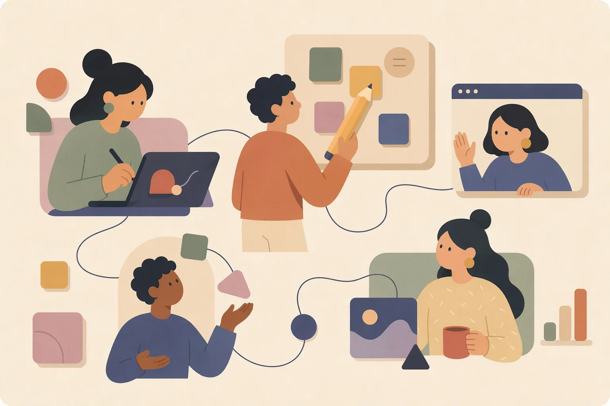</a>

[ 🟢 **Try it free →** ](https://gptimage2.veilo.dev/p/flat-style-explainer-illustration-abstract-people-working?utm_source=github&utm_medium=top-grid)

 

---

### 🖌️ Game character sprite sheet — 8 poses, single character
<a href="https://gptimage2.veilo.dev/p/game-character-sprite-sheet-8-poses-single?utm_source=github&utm_medium=top-grid">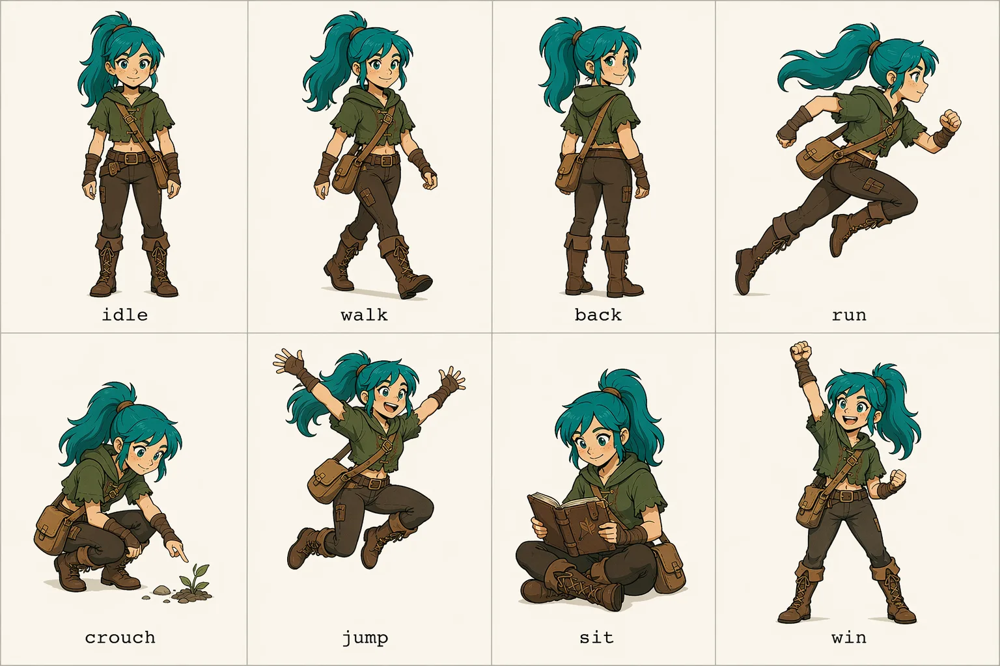</a>

[ 🟢 **Try it free →** ](https://gptimage2.veilo.dev/p/game-character-sprite-sheet-8-poses-single?utm_source=github&utm_medium=top-grid)

 

---

### 🖌️ Editorial blog header illustration — conceptual essay header
<a href="https://gptimage2.veilo.dev/p/editorial-blog-header-illustration-conceptual-essay-header?utm_source=github&utm_medium=top-grid">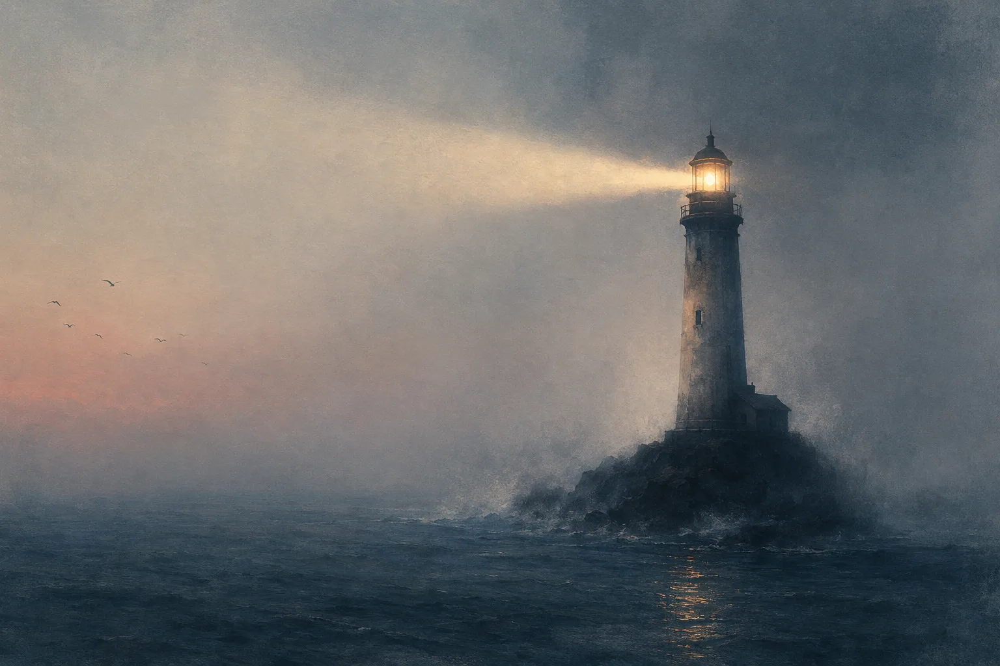</a>

[ 🟢 **Try it free →** ](https://gptimage2.veilo.dev/p/editorial-blog-header-illustration-conceptual-essay-header?utm_source=github&utm_medium=top-grid)

 

---

### 📊 3D isometric flow diagram for tech product explainer

[ 🟢 **Try it free →** ](https://gptimage2.veilo.dev/p/3d-isometric-flow-diagram-for-tech-product?utm_source=github&utm_medium=top-grid)

 

---

### 📊 Comparison table infographic — feature matrix
<a href="https://gptimage2.veilo.dev/p/comparison-table-infographic-feature-matrix?utm_source=github&utm_medium=top-grid">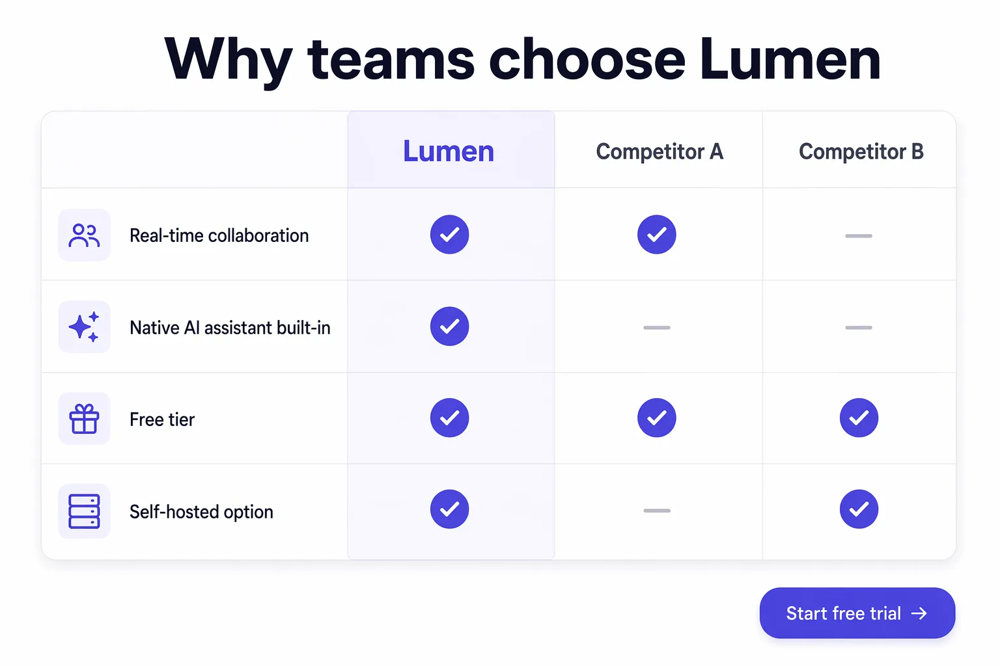</a>

[ 🟢 **Try it free →** ](https://gptimage2.veilo.dev/p/comparison-table-infographic-feature-matrix?utm_source=github&utm_medium=top-grid)

 

---

---

## 🧭 Find by Need

What are you trying to make?

| Use case | Count | Browse |
|----------|-------|--------|
| 🛒 E-commerce main image (Amazon, Shopify) | 4 | [→](https://gptimage2.veilo.dev/gallery?cat=ecommerce&utm_source=github) |
| 📱 Social media cover (Xiaohongshu / Instagram / X) | 4 | [→](https://gptimage2.veilo.dev/gallery?cat=social-media&utm_source=github) |
| 📰 Poster & marketing | 4 | [→](https://gptimage2.veilo.dev/gallery?cat=poster&utm_source=github) |
| 🎨 UI mockup / app screenshot | 4 | [→](https://gptimage2.veilo.dev/gallery?cat=ui-mockup&utm_source=github) |
| 📊 Infographic / flow diagram | 4 | [→](https://gptimage2.veilo.dev/gallery?cat=infographic&utm_source=github) |
| 📦 Product packaging | 4 | [→](https://gptimage2.veilo.dev/gallery?cat=packaging&utm_source=github) |
| 📷 Photography / photorealism | 4 | [→](https://gptimage2.veilo.dev/gallery?cat=photography&utm_source=github) |
| 🖌️ Illustration / artistic | 4 | [→](https://gptimage2.veilo.dev/gallery?cat=illustration&utm_source=github) |

---

## 📚 Full Prompt Index

Every prompt in the library, grouped by category. Click 🟢 to open the live page with one-click generation, full prompt text, sample variations, and use-case guidance.

### 🛒 ecommerce (4)

| Preview | Prompt | Intent | Try |
|---------|--------|--------|-----|
|  | **Amazon-style product main image with floating ingredients** | 电商主图 / Amazon listing / Shopify product hero | [▶️](https://gptimage2.veilo.dev/p/amazon-style-product-main-image-with-floating-ingredients?utm_source=github&utm_medium=full-index) |
|  | **Lifestyle product photography — product in real-world use** | 电商详情页 / 生活方式图 / Shopify section image | [▶️](https://gptimage2.veilo.dev/p/lifestyle-product-photography-product-in-real-world-use?utm_source=github&utm_medium=full-index) |
|  | **Minimalist product on bold color-block background** | 电商主图(品牌调性)/ 落地页 hero / Instagram feed product | [▶️](https://gptimage2.veilo.dev/p/minimalist-product-on-bold-color-block-background?utm_source=github&utm_medium=full-index) |
|  | **Flat-lay bundle/set arrangement, top-down hero** | 电商套装主图 / 礼盒图 / 详情页平铺 | [▶️](https://gptimage2.veilo.dev/p/flat-lay-bundle-set-arrangement-top-down-hero?utm_source=github&utm_medium=full-index) |

### 🖌️ illustration (4)

| Preview | Prompt | Intent | Try |
|---------|--------|--------|-----|
|  | **Children's book illustration — whimsical bedroom scene** | 童书插画 / 教育产品配图 / 儿童 App 启动图 | [▶️](https://gptimage2.veilo.dev/p/children-s-book-illustration-whimsical-bedroom-scene?utm_source=github&utm_medium=full-index) |
|  | **Flat-style explainer illustration — abstract people working** | SaaS 落地页 / 博客头图 / 公众号配图 / Notion 模板 | [▶️](https://gptimage2.veilo.dev/p/flat-style-explainer-illustration-abstract-people-working?utm_source=github&utm_medium=full-index) |
|  | **Game character sprite sheet — 8 poses, single character** | 游戏角色设计文档 / 同人创作参考 / 角色一致性测试 | [▶️](https://gptimage2.veilo.dev/p/game-character-sprite-sheet-8-poses-single?utm_source=github&utm_medium=full-index) |
|  | **Editorial blog header illustration — conceptual essay header** | 深度博客头图 / Medium 文章配图 / 公众号长文头图 | [▶️](https://gptimage2.veilo.dev/p/editorial-blog-header-illustration-conceptual-essay-header?utm_source=github&utm_medium=full-index) |

### 📊 infographic (4)

| Preview | Prompt | Intent | Try |
|---------|--------|--------|-----|
|  | **3D isometric flow diagram for tech product explainer** | 信息图 / 流程图 / 产品讲解配图 / SaaS landing graphic | [▶️](https://gptimage2.veilo.dev/p/3d-isometric-flow-diagram-for-tech-product?utm_source=github&utm_medium=full-index) |
|  | **Comparison table infographic — feature matrix** | 竞品对比图 / 落地页 / 销售物料 | [▶️](https://gptimage2.veilo.dev/p/comparison-table-infographic-feature-matrix?utm_source=github&utm_medium=full-index) |
| 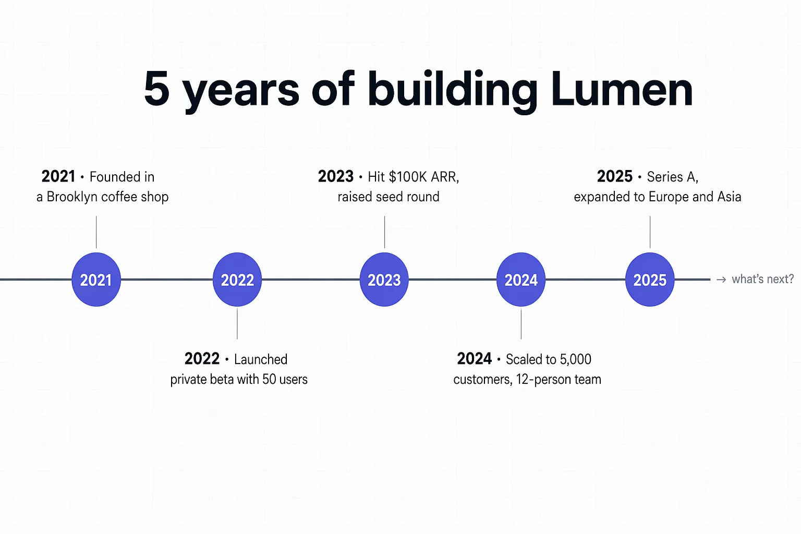 | **Horizontal timeline infographic with milestones** | 公司里程碑图 / 项目计划图 / 教程时间轴 | [▶️](https://gptimage2.veilo.dev/p/horizontal-timeline-infographic-with-milestones?utm_source=github&utm_medium=full-index) |
| 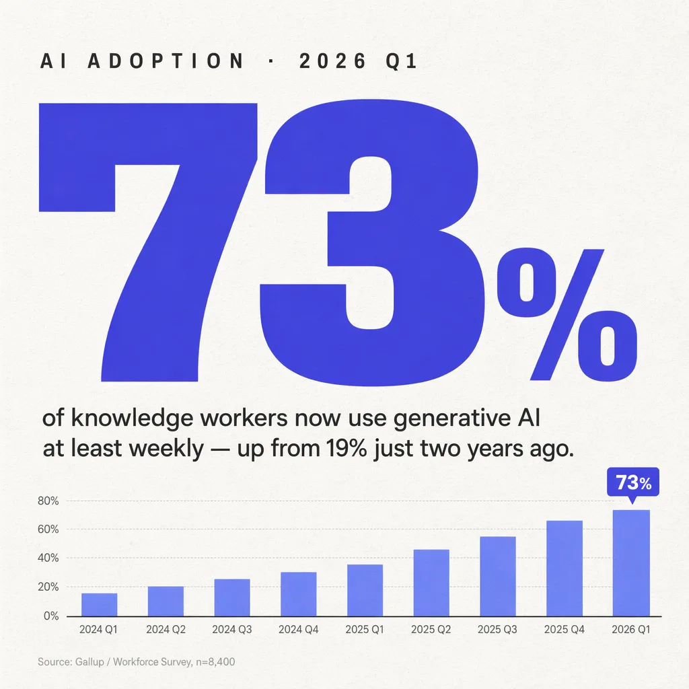 | **Single-stat data visualization card — viral hook** | X / 推特 viral 数据图 / LinkedIn 卡片 / 公众号配图 | [▶️](https://gptimage2.veilo.dev/p/single-stat-data-visualization-card-viral-hook?utm_source=github&utm_medium=full-index) |

### 📦 packaging (4)

| Preview | Prompt | Intent | Try |
|---------|--------|--------|-----|
| 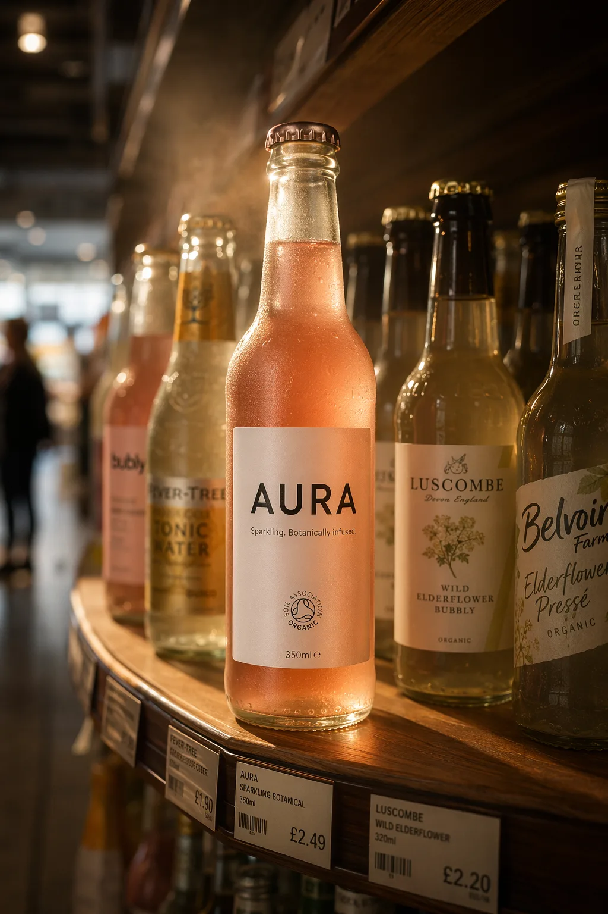 | **Premium beverage bottle on supermarket shelf, hero shot** | 饮料品牌包装设计 / 货架展示效果图 / Pitch deck 配图 | [▶️](https://gptimage2.veilo.dev/p/premium-beverage-bottle-on-supermarket-shelf-hero?utm_source=github&utm_medium=full-index) |
| 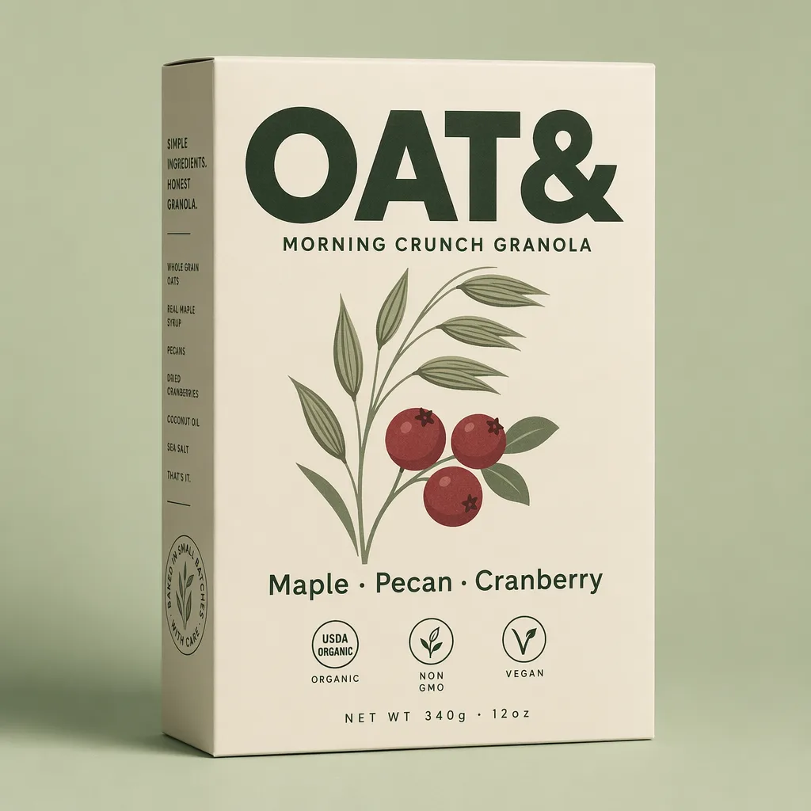 | **Minimalist food packaging — front-facing carton on color block** | 食品品牌主图 / 落地页 hero / 详情页 | [▶️](https://gptimage2.veilo.dev/p/minimalist-food-packaging-front-facing-carton-on-color?utm_source=github&utm_medium=full-index) |
| 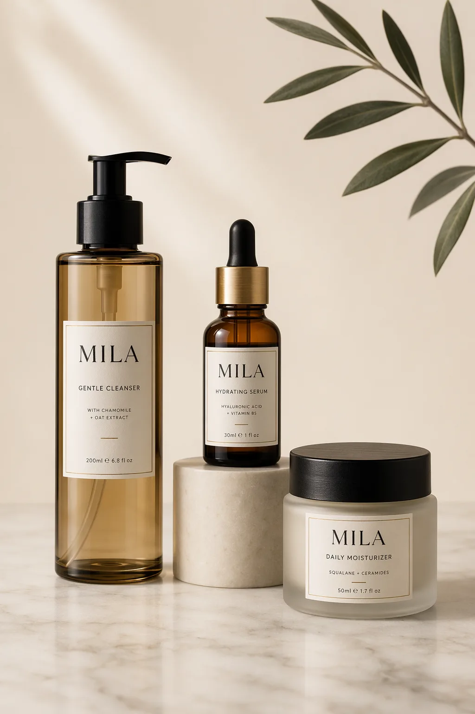 | **Skincare product trio — 3-piece set arrangement** | 护肤品牌主视觉 / 详情页 / 礼盒套装图 | [▶️](https://gptimage2.veilo.dev/p/skincare-product-trio-3-piece-set-arrangement?utm_source=github&utm_medium=full-index) |
| 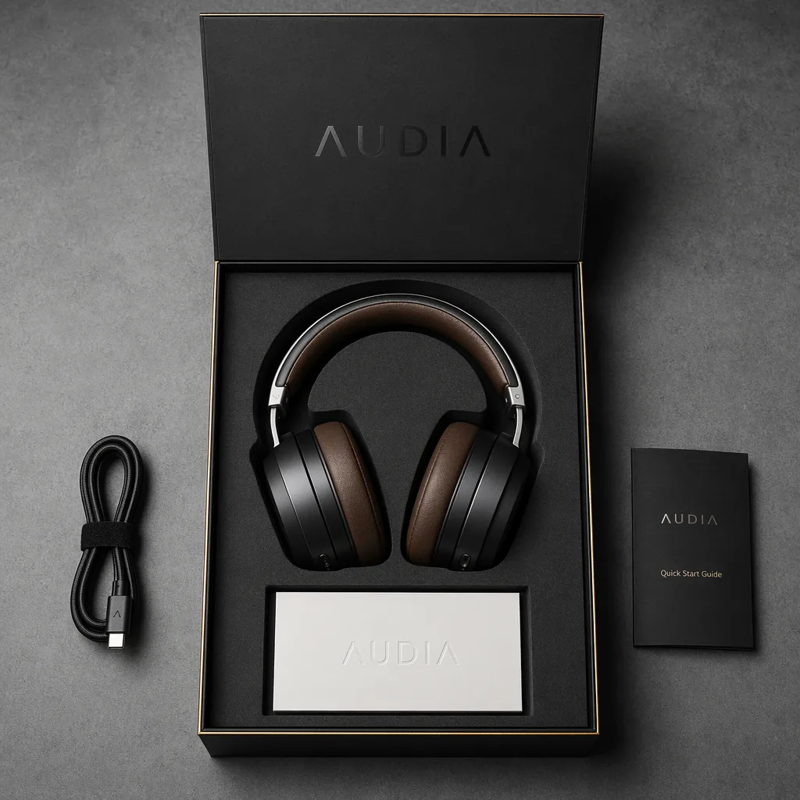 | **Tech product unboxing reveal — premium electronics packaging** | 科技产品发布物料 / 详情页配图 / 开箱视频封面 | [▶️](https://gptimage2.veilo.dev/p/tech-product-unboxing-reveal-premium-electronics-packaging?utm_source=github&utm_medium=full-index) |

### 📷 photography (4)

| Preview | Prompt | Intent | Try |
|---------|--------|--------|-----|
| 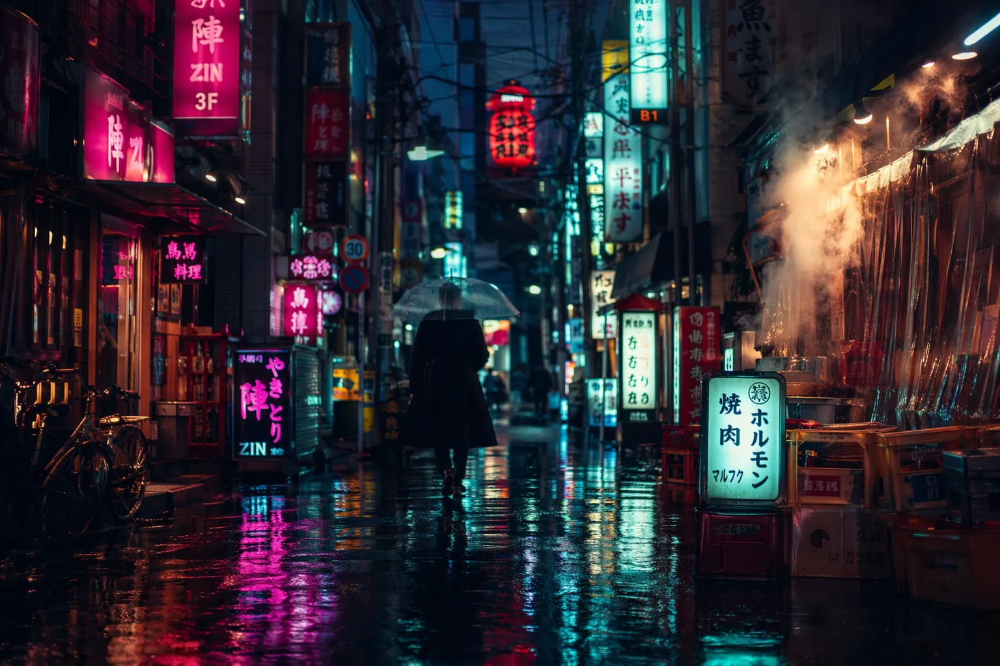 | **Cinematic Tokyo night street — neon-soaked rainy alley** | 城市摄影 / 电影预告片配图 / 公众号封面 / 短视频背景 | [▶️](https://gptimage2.veilo.dev/p/cinematic-tokyo-night-street-neon-soaked-rainy-alley?utm_source=github&utm_medium=full-index) |
|  | **Professional studio headshot — corporate / LinkedIn portrait** | LinkedIn 头像 / 公司官网团队页 / 个人品牌头图 | [▶️](https://gptimage2.veilo.dev/p/professional-studio-headshot-corporate-linkedin-portrait?utm_source=github&utm_medium=full-index) |
| 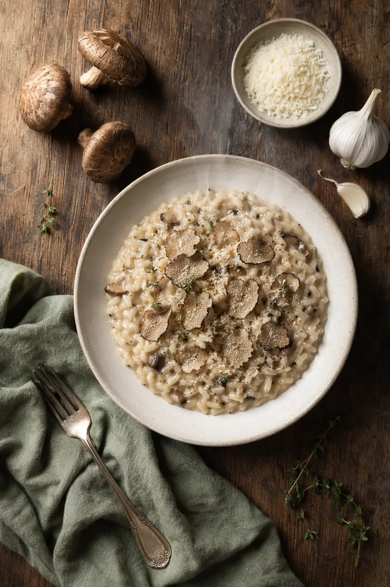 | **Food photography — overhead flat-lay, magazine quality** | 餐饮品牌官网 / 食谱博客 / Bon Appetit 风格 / 公众号头图 | [▶️](https://gptimage2.veilo.dev/p/food-photography-overhead-flat-lay-magazine-quality?utm_source=github&utm_medium=full-index) |
|  | **Wide-angle landscape — dramatic Iceland glacier scene** | 旅游 / 风光摄影 / 桌面壁纸 / 公众号长图配图 | [▶️](https://gptimage2.veilo.dev/p/wide-angle-landscape-dramatic-iceland-glacier-scene?utm_source=github&utm_medium=full-index) |

### 📰 poster (4)

| Preview | Prompt | Intent | Try |
|---------|--------|--------|-----|
|  | **Bilingual event poster with cinematic key visual** | 活动海报 / event poster / bilingual marketing | [▶️](https://gptimage2.veilo.dev/p/bilingual-event-poster-with-cinematic-key-visual?utm_source=github&utm_medium=full-index) |
| 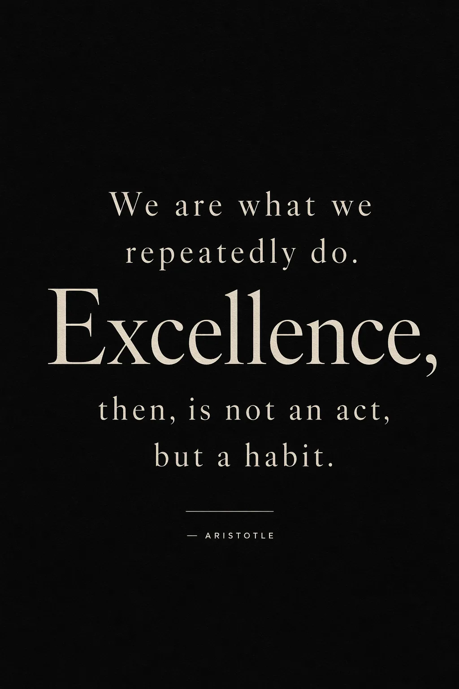 | **Typography-only quote poster, gallery print quality** | 金句海报 / 装饰画 / 办公室墙画 / Etsy 印刷品 | [▶️](https://gptimage2.veilo.dev/p/typography-only-quote-poster-gallery-print-quality?utm_source=github&utm_medium=full-index) |
| 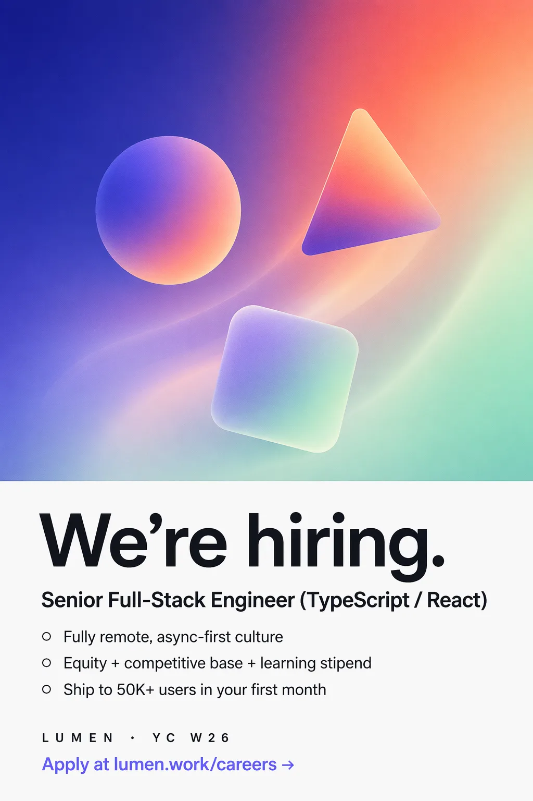 | **Modern recruiting / hiring poster, startup style** | 招聘海报 / 内推海报 / LinkedIn 招聘图 / 公众号配图 | [▶️](https://gptimage2.veilo.dev/p/modern-recruiting-hiring-poster-startup-style?utm_source=github&utm_medium=full-index) |
| 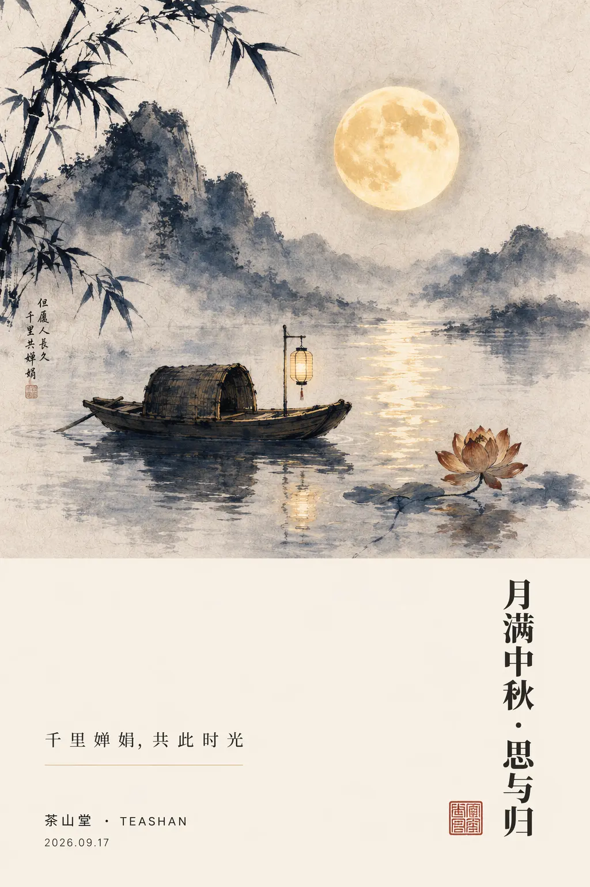 | **Chinese festival poster — Mid-Autumn / Spring Festival aesthetic** | 节日营销海报 / 公众号头图 / 商场印刷品 | [▶️](https://gptimage2.veilo.dev/p/chinese-festival-poster-mid-autumn-spring-festival-aesthetic?utm_source=github&utm_medium=full-index) |

### 📱 social-media (4)

| Preview | Prompt | Intent | Try |
|---------|--------|--------|-----|
|  | **Xiaohongshu (Little Red Book) cover with bold Chinese typography** | 小红书封面 / Chinese social media cover / lifestyle post hero | [▶️](https://gptimage2.veilo.dev/p/xiaohongshu-little-red-book-cover-with-bold?utm_source=github&utm_medium=full-index) |
| 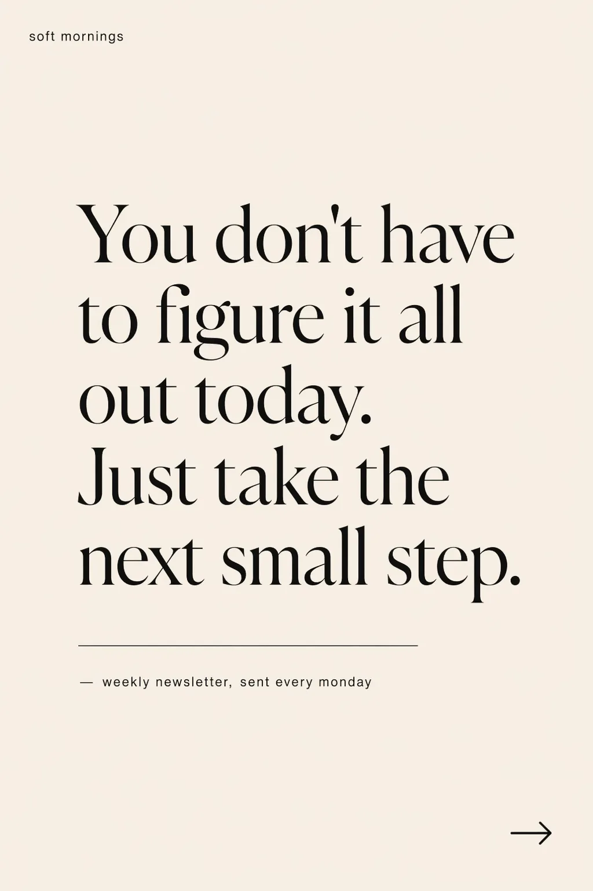 | **Instagram carousel slide 1 — quote-driven hook** | Instagram 轮播首图 / 金句卡片 / Pinterest pin | [▶️](https://gptimage2.veilo.dev/p/instagram-carousel-slide-1-quote-driven-hook?utm_source=github&utm_medium=full-index) |
| 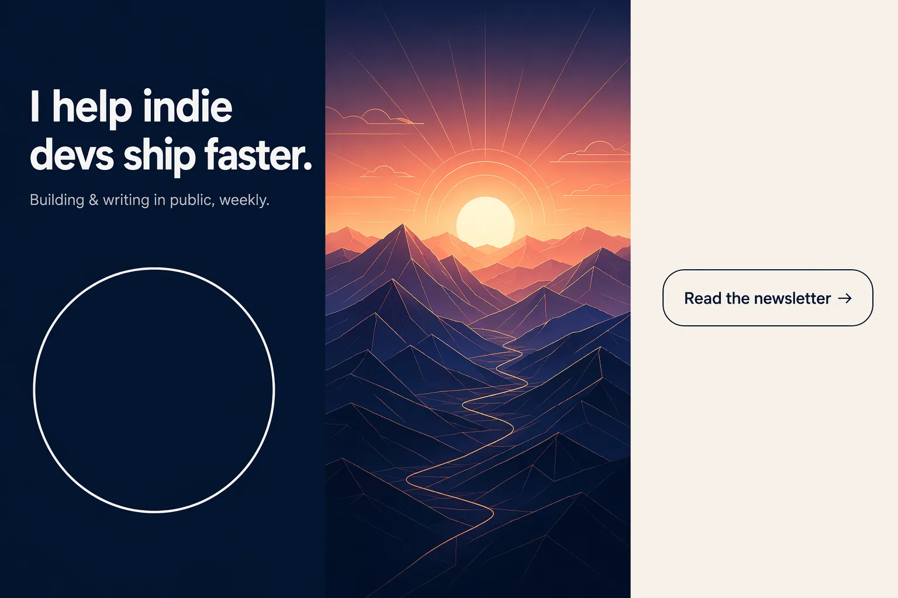 | **X (Twitter) header banner with text and product hint** | X / Twitter 个人主页头图 / LinkedIn cover / YouTube channel banner | [▶️](https://gptimage2.veilo.dev/p/x-twitter-header-banner-with-text-and?utm_source=github&utm_medium=full-index) |
| 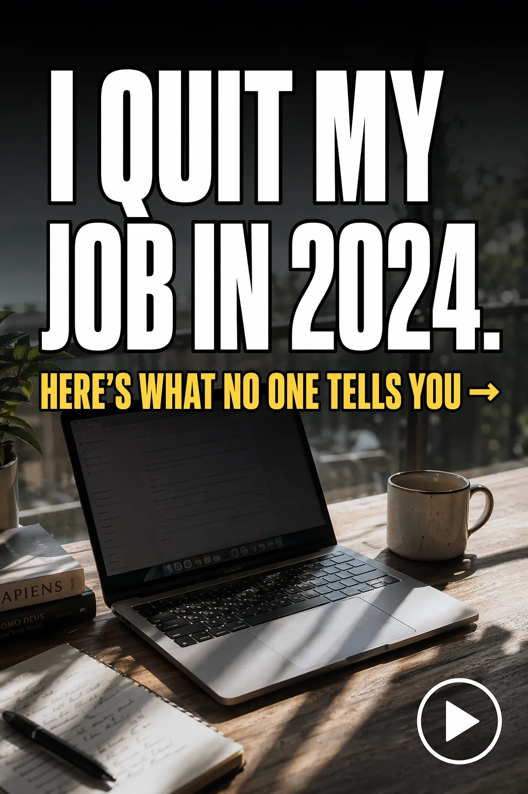 | **TikTok / Reels vertical cover with bold hook text** | TikTok 封面 / Instagram Reels cover / 抖音视频封面 | [▶️](https://gptimage2.veilo.dev/p/tiktok-reels-vertical-cover-with-bold-hook?utm_source=github&utm_medium=full-index) |

### 🎨 ui-mockup (4)

| Preview | Prompt | Intent | Try |
|---------|--------|--------|-----|
|  | **iOS app home screen mockup, hyper-realistic iPhone screenshot** | App UI mockup / iPhone screenshot / product design preview | [▶️](https://gptimage2.veilo.dev/p/ios-app-home-screen-mockup-hyper-realistic-iphone?utm_source=github&utm_medium=full-index) |
| 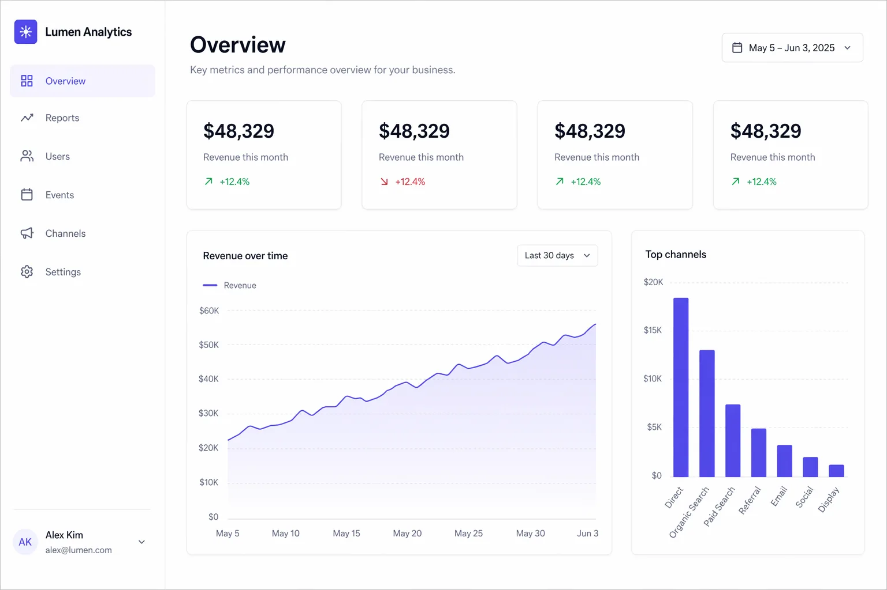 | **SaaS dashboard mockup — analytics overview** | SaaS 落地页配图 / 产品 demo 截图 / 投资人 deck 配图 | [▶️](https://gptimage2.veilo.dev/p/saas-dashboard-mockup-analytics-overview?utm_source=github&utm_medium=full-index) |
| 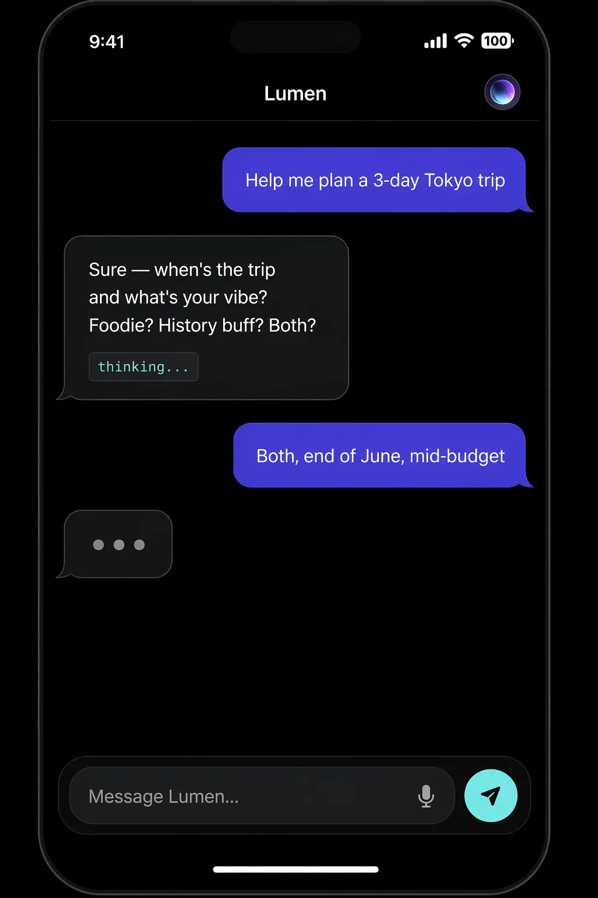 | **Dark-mode AI chat interface mockup** | AI 聊天 App mockup / 产品 demo / 落地页 hero | [▶️](https://gptimage2.veilo.dev/p/dark-mode-ai-chat-interface-mockup?utm_source=github&utm_medium=full-index) |
| 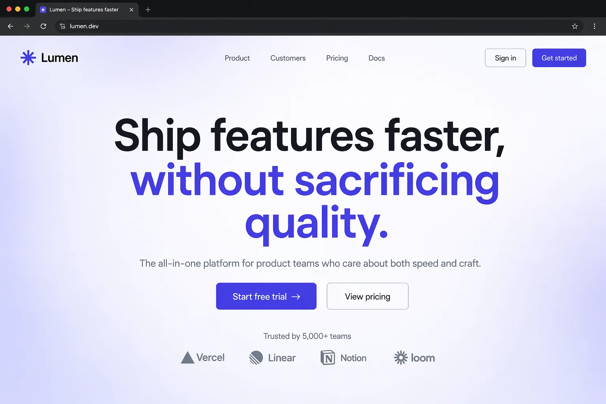 | **SaaS landing page hero section mockup** | SaaS 官网 hero / 投资人 pitch 配图 / 产品发布配图 | [▶️](https://gptimage2.veilo.dev/p/saas-landing-page-hero-section-mockup?utm_source=github&utm_medium=full-index) |

---

## 🧪 Prompt Lab — build your own

Don't see exactly what you need? Open the [Prompt Lab](https://gptimage2.veilo.dev/lab?utm_source=github) and assemble a prompt from atoms:

- **Subject** — what's in the image
- **Style** — photorealistic / illustration / 3D / flat
- **Lighting** — studio / natural / cinematic / neon
- **Text** — what words appear (gpt-image-2 nails text rendering)
- **Aspect** — square / vertical / horizontal
- **Camera** — close-up / wide / isometric / overhead

The Lab will compose a structured prompt for you and run it instantly.

---

## 📖 Prompting Cheatsheet

The 5 things gpt-image-2 does better than other models, and how to exploit them:

1. **Pixel-perfect text** — quote what you want: `that reads "BLUE BOTTLE"`. Best at 1–5 words.
2. **Multi-element composition** — dense 200-word prompts work; describe scene + subject + lighting + camera + palette
3. **2K native resolution** — ask for it explicitly: "8K detail" or "ultra-sharp focus on..."
4. **Cross-image consistency** — reference earlier outputs by ID for sequels
5. **Reasoning before generating** — give the model the goal, not just keywords ("a marketing poster that emphasizes safety")

Full guide: [https://gptimage2.veilo.dev/docs/prompting](https://gptimage2.veilo.dev/docs/prompting?utm_source=github)

---

## 🆚 Comparisons

How does this stack up against other tools?

- [vs. EvoLinkAI awesome-prompts](https://gptimage2.veilo.dev/vs/evolink) (11.3k★) — feature-rich library with no playground
- [vs. YouMind-OpenLab](https://gptimage2.veilo.dev/vs/youmind) (4.1k★) — high volume, lower hand-curation
- [vs. freestylefly](https://gptimage2.veilo.dev/vs/freestylefly) (3.1k★) — engineering-flavored "Prompt as Code" framework
- [vs. DALL·E 3](https://gptimage2.veilo.dev/vs/dalle3) — OpenAI's previous-gen image model
- [vs. Midjourney](https://gptimage2.veilo.dev/vs/midjourney) — premium aesthetic-focused generator

---

## 🤝 Contribute

We accept new prompts via PR. Quality bar:

- ✅ Real preview image (≤200 KB WebP)
- ✅ Clear use-case category
- ✅ Original or sourced (with credit)
- ❌ No celebrity / brand / NSFW

See [CONTRIBUTING.md](CONTRIBUTING.md).

Looking for a good first issue? Try:

- Add a 33rd prompt for a category that has 4 items currently
- Translate one prompt into a language not yet covered
- Improve the cheatsheet with a new technique

---

## 📜 License

- **Code**: MIT
- **Prompts & previews**: CC-BY-4.0 — free for commercial use, just credit this repo

See [LICENSE](LICENSE).

---

## 💼 Sponsors

Building this is free for users. If your team uses these prompts in production, consider [supporting the project](https://gptimage2.veilo.dev/pricing?utm_source=github) — it pays the API bills.

---

**Built by [@XZXY-AI](https://github.com/XZXY-AI)** &nbsp;·&nbsp; **[⭐ Star](https://github.com/XZXY-AI/awesome-gpt-image-2-playground)** to unlock +1 daily free generation &nbsp;·&nbsp; **[Try it now →](https://gptimage2.veilo.dev?utm_source=github)**

Last updated: 2026-05-06 &nbsp;·&nbsp; Generated at 2026-05-06T00:30:41.902Z

