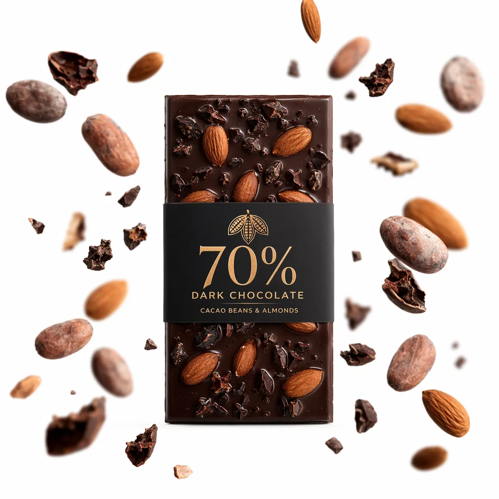
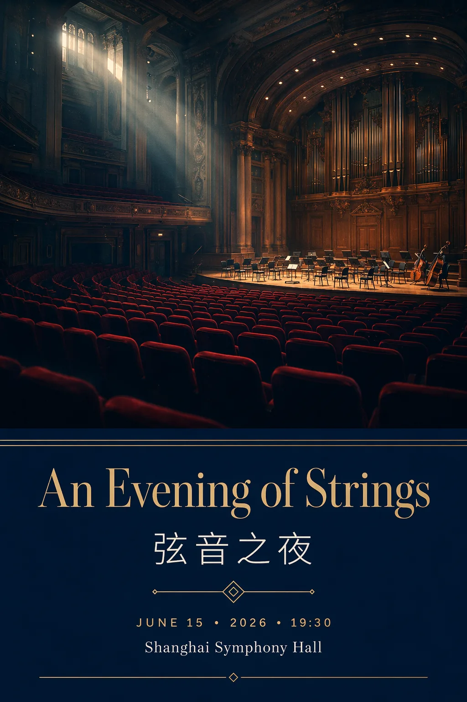
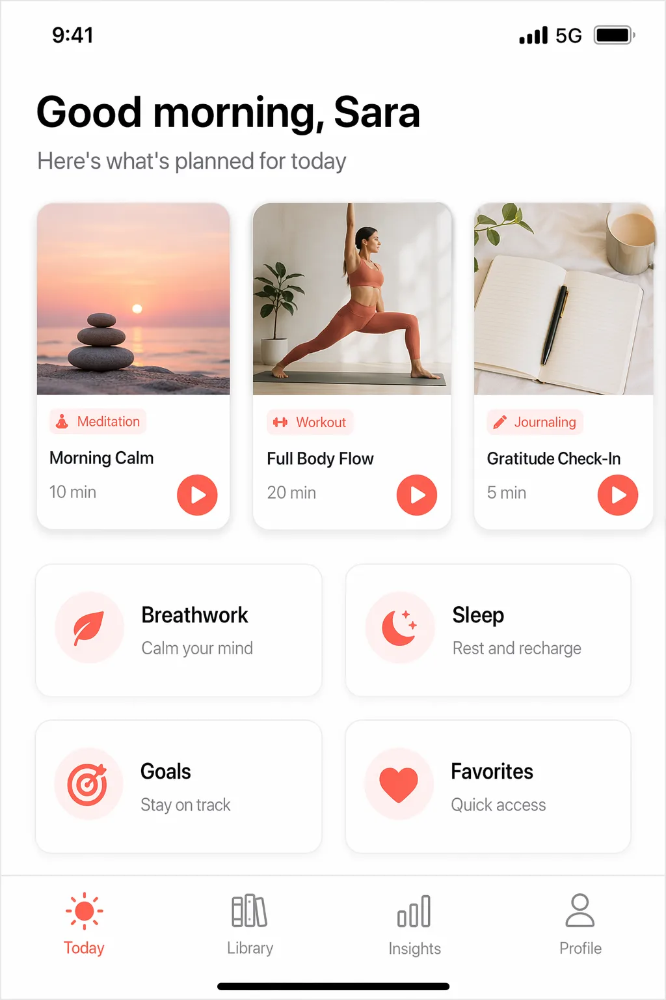
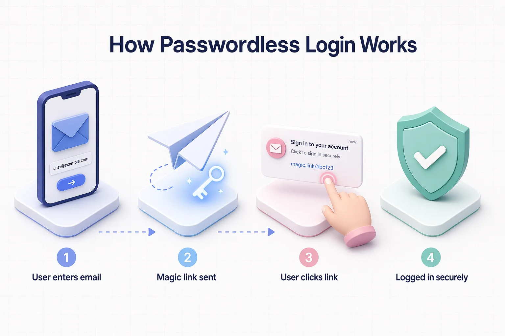

# 🎨 awesome-gpt-image-2-playground

**唯一可在浏览器内即时免费运行的 GPT Image 2 提示词库。**

[ ▶️ **免费在线试用** ](https://gptimage2.veilo.dev?utm_source=github&utm_medium=readme&utm_campaign=hero) &nbsp;·&nbsp; [文档](https://gptimage2.veilo.dev/docs) &nbsp;·&nbsp; [Discord](https://discord.gg/TODO) &nbsp;·&nbsp; [X](https://x.com/gptimage2)

<table>
<tr>
<td></td>
<td></td>
<td></td>
<td></td>
<td></td>
</tr>
</table>

🌐 **语言**: [English](README.md) · [简体中文](README_zh-CN.md) · [繁體中文](README_zh-TW.md) · [日本語](README_ja.md) · [한국어](README_ko.md) · [Español](README_es.md) · [Português](README_pt.md) · [Français](README_fr.md) · [Deutsch](README_de.md) · [العربية](README_ar.md) · [Русский](README_ru.md) · [Tiếng Việt](README_vi.md)

---

## 🎁 为什么需要这个项目

其他 GPT Image 2 提示词库,让你"复制、粘贴、祈祷"。**我们让你直接在浏览器里跑每一条提示词,免费。** 点击下方任何 🟢 `Try` 按钮——前 3 次生成无需登录。

- 🚀 **32 条精选 prompt** *(每天新增,目标 D7 达到 200 条)*,每条都有真实预览图
- 🎯 **意图优先** —— 按"我要做什么"分类("亚马逊主图"、"小红书封面"),而不是按抽象的风格分
- 🧪 **Prompt Lab** —— 可视化提示词构建器,改任意元素即重生成
- 🌍 **12 语言** —— 服务全球创作者
- 🔄 **每日更新** —— 每天早上有新的 viral prompt 入库

---

## 🔥 精选案例

> 5 条手挑的样板。点击 `▶ Try` 在浏览器中免费运行。

### 🛒 电商:亚马逊风格产品主图

配料悬浮 + 纯白背景 + 棚拍光影 —— 亚马逊 Listing 经典款。

[ 🟢 **免费试用 →** ](https://gptimage2.veilo.dev/p/ec-001?utm_source=github) &nbsp; [📋 查看 YAML](prompts/ecommerce/001-amazon-main-image.yml)

 

---

### 📱 社媒:小红书爆款封面

中文大字标题 + 生活感照片。3:4 竖版,点击率拉满。

[ 🟢 **免费试用 →** ](https://gptimage2.veilo.dev/p/sm-001?utm_source=github) &nbsp; [📋 查看 YAML](prompts/social-media/001-xiaohongshu-cover.yml)

 

---

### 📰 海报:双语活动海报

电影感主视觉 + 精致中英文排版,可直出印刷。

[ 🟢 **免费试用 →** ](https://gptimage2.veilo.dev/p/po-001?utm_source=github) &nbsp; [📋 查看 YAML](prompts/poster/001-event-poster-bilingual.yml)

 

---

### 🎨 UI Mockup:iOS App 首页

像素级 iPhone 截图。产品设计师 / 独立开发者必备。

[ 🟢 **免费试用 →** ](https://gptimage2.veilo.dev/p/ui-001?utm_source=github) &nbsp; [📋 查看 YAML](prompts/ui-mockup/001-ios-app-home.yml)

 

---

### 📊 信息图:3D 等距流程图

Stripe / Linear 风格的营销图。SaaS 落地页和产品讲解都好用。

[ 🟢 **免费试用 →** ](https://gptimage2.veilo.dev/p/ig-001?utm_source=github) &nbsp; [📋 查看 YAML](prompts/infographic/001-flow-diagram-3d.yml)

 

---

## 🧭 按需求查找

你想做什么?

| 场景 | 数量 | 浏览 |
|------|------|------|
| 🛒 电商主图 | 4 | [→](prompts/ecommerce/) |
| 📱 社媒封面(小红书 / Instagram / X / TikTok) | 4 | [→](prompts/social-media/) |
| 📰 海报与营销物料 | 4 | [→](prompts/poster/) |
| 🎨 UI Mockup / App 截图 | 4 | [→](prompts/ui-mockup/) |
| 📊 信息图 / 流程图 | 4 | [→](prompts/infographic/) |
| 📦 产品包装 | 4 | [→](prompts/packaging/) |
| 📷 摄影 / 写实 | 4 | [→](prompts/photography/) |
| 🖌️ 插画 / 艺术 | 4 | [→](prompts/illustration/) |

---

## 🧪 Prompt Lab —— 自己拼

没有完全合适的?打开 [**Prompt Lab →**](https://gptimage2.veilo.dev/lab),用 6 个原子拼出你要的 prompt:

| 原子 | 示例 |
|------|------|
| **主体** | 图里有什么 |
| **风格** | 写实 / 插画 / 3D / 扁平 |
| **光照** | 棚拍 / 自然 / 电影 / 霓虹 |
| **文字** | 要渲染的精确文字(gpt-image-2 强项) |
| **比例** | 方形 / 竖版 / 横版 |
| **机位** | 特写 / 大全景 / 等距 / 俯拍 |

Lab 会自动组合结构化 prompt 并立即运行。

---

## 📚 Prompt 速查表

gpt-image-2 比其他模型强在哪 5 点,怎么用上:

1. **像素级文字渲染** —— 用引号包住要渲染的字: `that reads "BLUE BOTTLE"`,1–5 个词最稳。
2. **多元素复合** —— 一次性给 200 字密集描述: 场景 + 主体 + 光照 + 机位 + 配色,模型能扛住。
3. **2K 原生分辨率** —— 显式要求: `"8K detail"` 或 `"ultra-sharp focus on..."`。
4. **跨图一致性** —— 引用之前生成的图 ID 做系列。
5. **推理后生成** —— 给目标而非关键词。`"a marketing poster that emphasizes safety"` 比 `"safety poster"` 效果好得多。

完整指南: [gptimage2.veilo.dev/docs/prompting](https://gptimage2.veilo.dev/docs/prompting)

---

## 🤝 贡献

欢迎 PR 提交新 prompt。质量门槛:
- ✅ 真实预览图(≤200 KB WebP)
- ✅ 明确分类
- ✅ 原创或注明来源
- ❌ 不收: 名人 / 品牌 / NSFW

详见 [CONTRIBUTING.md](CONTRIBUTING.md)。

---

## 📜 协议

- **代码**: MIT
- **Prompt 与预览图**: CC-BY-4.0 —— 商用免费,注明来源即可

详见 [LICENSE](LICENSE)。

---

## 💼 赞助

跑这个免费 playground 真烧钱(API + 基础设施)。如果你的团队在生产环境用这些 prompt,可以 [支持项目 →](https://gptimage2.veilo.dev/pricing) —— 帮我们把账单付了,大家继续免费用。

---

**作者 [@XZXY-AI](https://github.com/XZXY-AI)** &nbsp;·&nbsp; **[⭐ Star 仓库](https://github.com/XZXY-AI/awesome-gpt-image-2-playground)** 关注更新 &nbsp;·&nbsp; **[立即试用 →](https://gptimage2.veilo.dev)**

